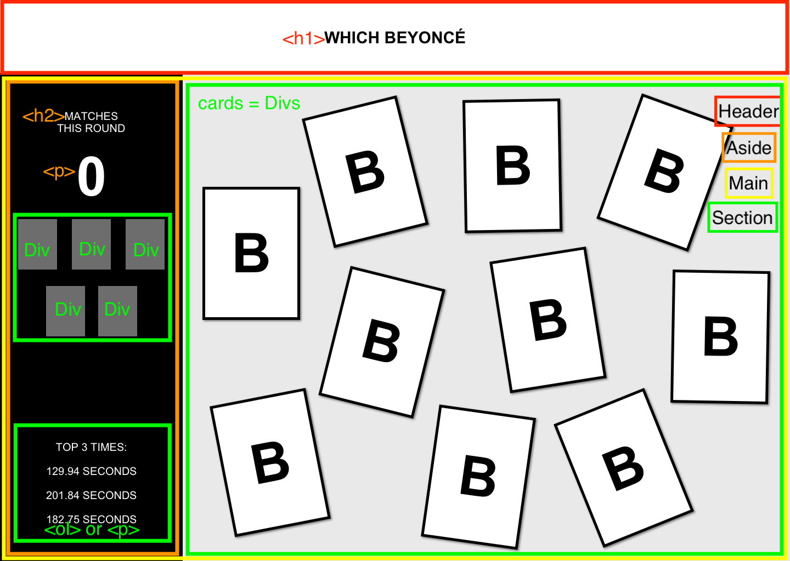

## Overview
Which Beyoncé? is a memory matching card game that I built with a team during module 1 of 4 at [Turing School of Software and Design](https://turing.io/).
Each player takes turn flipping over two cards at a time. 
If they match, that player “scores”. 
If the two cards don’t match, they must be flipped back over. 
The goal is the get the greatest amount of matches.

## Learning Goals
Solidify and demonstrate understanding of:
- semantic HTML
- DRY JavaScript
- localStorage to persist data
- Iterate through/filter DOM elements using for loops
- Understand the difference between the data model and how the data is displayed on the DOM
- Match/recreate a UI and create a great UX

### Comps

### Wireframing

### Game in action
